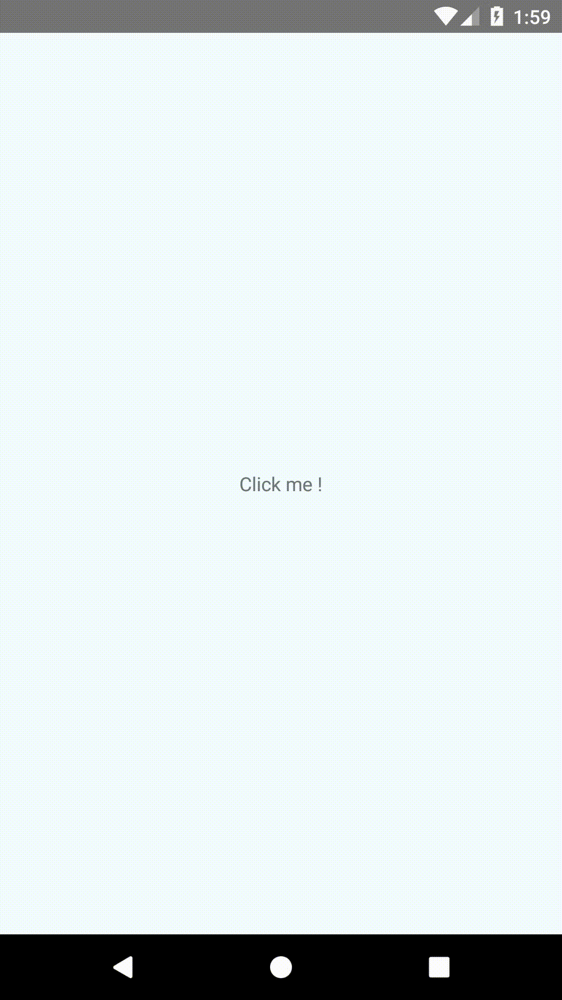

# react-native-android-location-enabler

Allow to display a GoogleMap like android popup to ask for user to enable location services if disabled



## Getting started

**ReactNative >= 0.60.0**

### Installation

`$ npm install react-native-android-location-enabler --save`

Since ReactNative 0.60.0 and ReactNative Cli 2.0.0, no action is needed to add a native module.

**ReactNative < 0.60.0**

### Installation

`$ npm install react-native-android-location-enabler@1.1.0 --save`

#### Configuration

`$ react-native link react-native-android-location-enabler`

#### Manual Configuration

1. Open up `android/app/src/main/java/[...]/MainApplication.java`
  - Add `import com.heanoria.library.reactnative.locationenabler.RNAndroidLocationEnablerPackage;` to the imports at the top of the file
  - Add `new RNAndroidLocationEnablerPackage()` to the list returned by the `getPackages()` method
2. Append the following lines to `android/settings.gradle`:
  	```
  	include ':react-native-android-location-enabler'
  	project(':react-native-android-location-enabler').projectDir = new File(rootProject.projectDir, 	'../node_modules/react-native-android-location-enabler/android')
  	```
3. Insert the following lines inside the dependencies block in `android/app/build.gradle`:
  	```
      compile project(':react-native-android-location-enabler')
  	```

## Usage
```javascript
import RNAndroidLocationEnabler from 'react-native-android-location-enabler';

RNAndroidLocationEnabler.promptForEnableLocationIfNeeded({interval: 10000, fastInterval: 5000})
  .then(data => {
    // The user has accepted to enable the location services
    // data can be :
    //  - "already-enabled" if the location services has been already enabled
    //  - "enabled" if user has clicked on OK button in the popup
  }).catch(err => {
    // The user has not accepted to enable the location services or something went wrong during the process
    // "err" : { "code" : "ERR00|ERR01|ERR02", "message" : "message"}
    // codes : 
    //  - ERR00 : The user has clicked on Cancel button in the popup
    //  - ERR01 : If the Settings change are unavailable
    //  - ERR02 : If the popup has failed to open
  });
```
  
